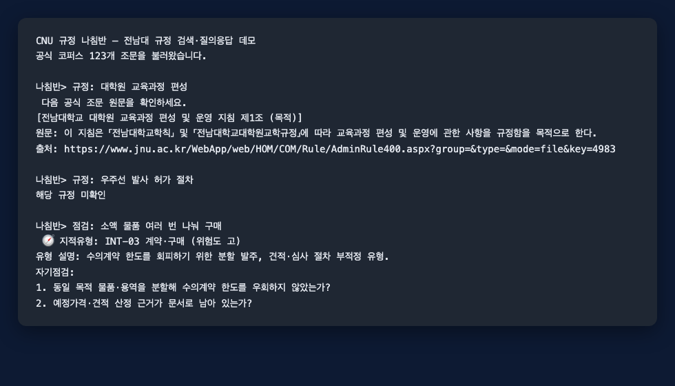
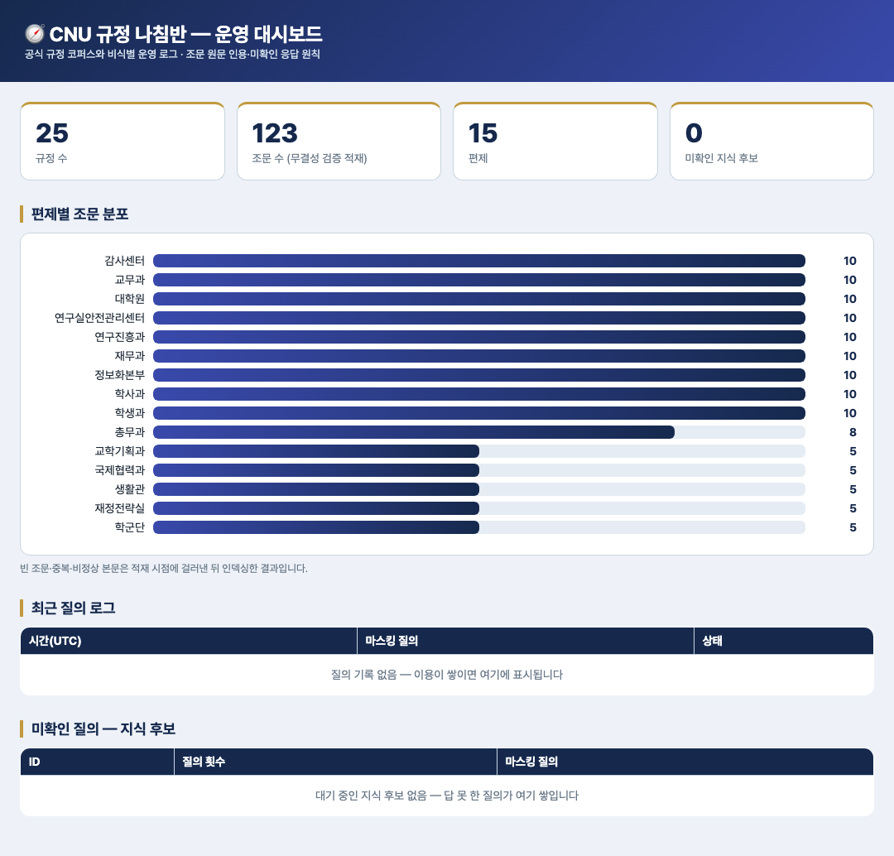

# CNU 규정 나침반

전남대학교 공개 규정·지침을 조문 단위로 검색하고, 근거 원문과 공식 URL을 함께
제시하는 표준 라이브러리 기반 데모다. 선택 기능으로 청렴 자기점검, 운영 로그,
대시보드와 MCP 도구를 제공한다.

**🔗 라이브 대시보드**: https://yousunjung84-edu.github.io/cnu-rule-compass/dashboard.html

### 규정 질의응답 — 물으면 조문이 답하고, 없으면 지어내지 않는다



규정을 물으면 조문 원문·규정명·공식 URL을 인용하고, 없는 규정을 물으면 억지로
조문을 만들지 않고 "해당 규정 미확인"으로 답한다. 업무 상황을 넣으면 감사 지적
유형과 자기점검 문항을 연결한다.

### 운영 대시보드 — 편제별 조문 분포·미확인 질의(지식 후보)



### 세 가지 설계 축

1. **2단 검색** — 질의를 먼저 후보 규정으로 좁히고(규정명·편제·조문제목 프로필)
   그 안에서 조문을 찾는다. 일반 행정어만 겹친 규정으로는 좁히지 않고, 못 좁히면
   전체 검색으로 폴백한다(오배제 방지). 결과의 `routing` 필드로 경로가 보인다.
2. **적재 대장(역전된 승인)** — 모든 조문을 사람이 승인하는 대신, 자동 무결성
   검증(빈 본문·중복·비정상 본문·출처 URL)을 기본으로 두고 검증에서 이탈한
   것만 승인 큐로 올린다. 대장(`ingest_ledger`)에 코퍼스 지문·검증 규칙 버전·
   사유별 거부 수가 남아 "이 답변의 근거가 어떻게 검증됐는지" 추적된다.
3. **시점 질의(as-of)** — 감사 대응의 실제 질문은 "지금 규정"이 아니라 "그 업무
   당시 규정"이다. 개정 계열의 각 판본에 유효기간을 부여해, `시점: 연구비 인건비
   @2015-06-01`처럼 물으면 그 날짜에 유효했던 판본의 조문을 당시 출처와 함께
   답한다. MCP 도구 `get_article_as_of`로도 노출된다.

> **데이터 범위 안내** — 이 공개 저장소에는 민감 서식(선거·서약서·개인정보 필드
> 등)을 제외한 **데모 샘플 코퍼스**(`data/rules_corpus.sample.json`)만 포함한다.
> clone하면 이 샘플로 검색·조문 인용·미확인 응답·청렴 점검이 즉시 동작한다.
> 전량 코퍼스는 각 기관이 `collect_rules.py`로 자기 규정을 직접 수집해 만든다
> (`data/rules_corpus.json`이 있으면 그것을, 없으면 샘플을 자동 사용).

## 실행

Python 3.10 이상에서 외부 패키지 없이 핵심 기능과 테스트를 실행할 수 있다.

```bash
python3 app.py
python3 -m unittest discover tests/ -v
python3 -m unittest discover -v
```

MCP 서버만 `mcp` 패키지를 실행 시점에 지연 임포트한다.

```bash
python3 -m src.mcp_server
```

## 안전 경계

- 검색 로더는 빈 본문, 30,000자 초과 본문, 동일 레코드 중복, 비공식 URL을 제외한다.
- 검색 결과는 `record_id`로 판본을 식별하며 `get_article`은 한 레코드만 반환한다.
- LLM 재서술은 기본적으로 꺼져 있다. 켜더라도 문장별 근거와 신규 수치·조문명을
  검증하지 못하면 공식 원문 안내로 되돌아간다.
- 운영 로그는 Unicode 정규화 후 PII를 재귀 마스킹하며, source 필드는 코퍼스의
  검증된 `record_id`로 재구성한다.
- 로그 손상이 감지되면 `.corrupt-*.bak`을 남기고 예외를 발생시켜 자동 덮어쓰기를
  중단한다.
- 저장소는 POSIX `flock`과 Windows `msvcrt` lockfile을 사용한다. 모든 기록자는
  동일한 `runtime/.store.lock` 프로토콜을 사용해야 다중 프로세스 안전성이 유지된다.

데이터 출처와 재배포 조건은 [DATA_PROVENANCE.md](DATA_PROVENANCE.md)를 확인한다.
코드는 [MIT License](LICENSE)로 배포한다.
